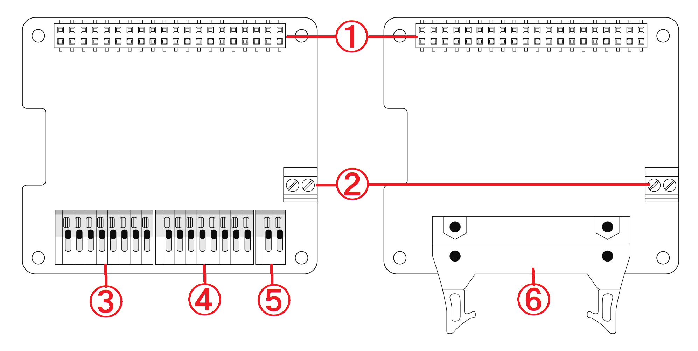
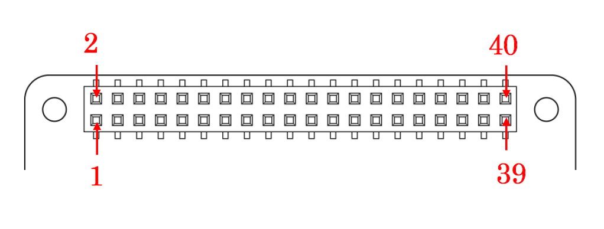
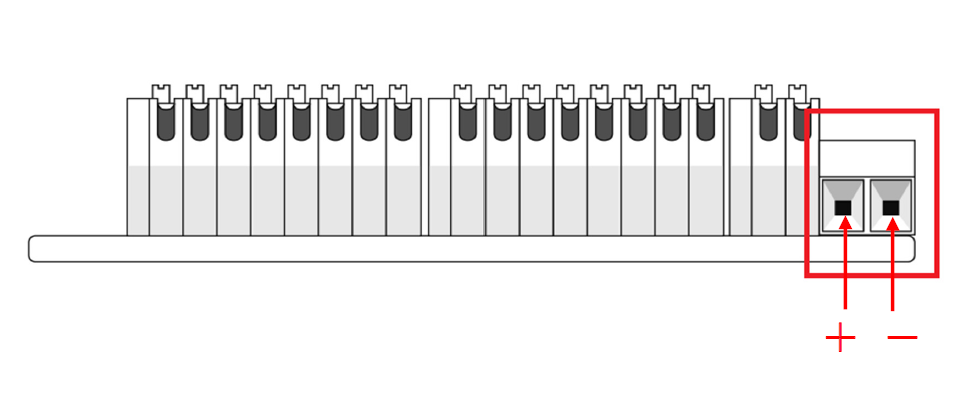
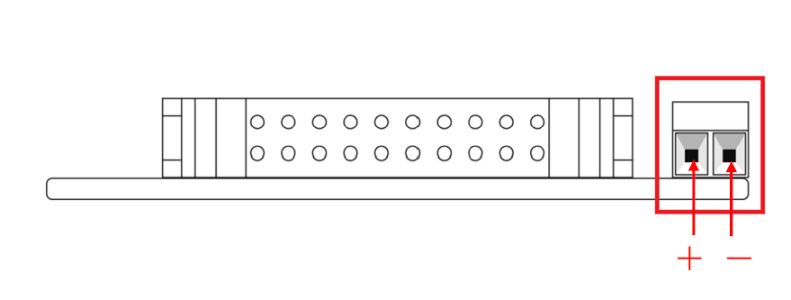
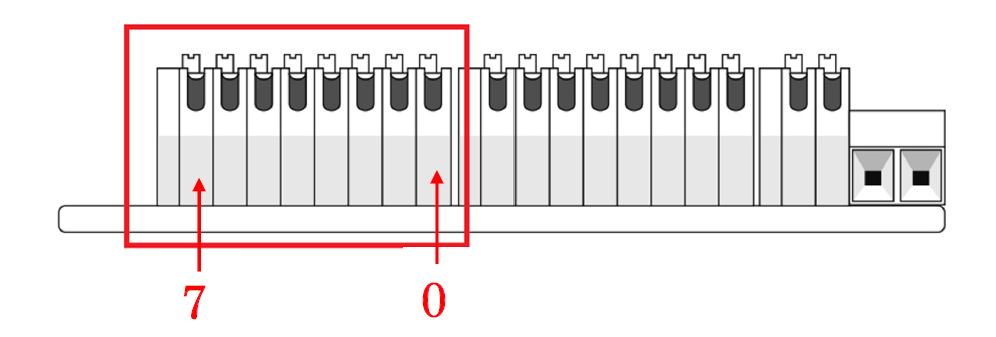
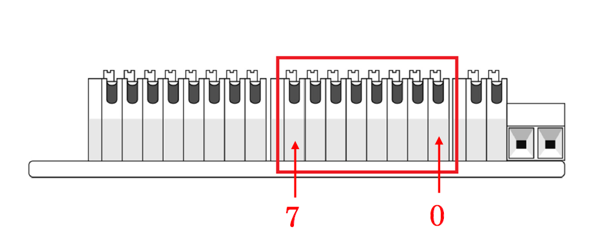
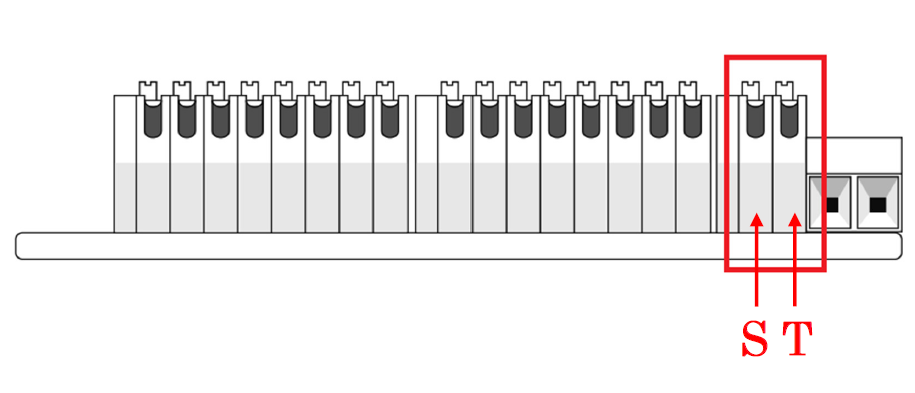
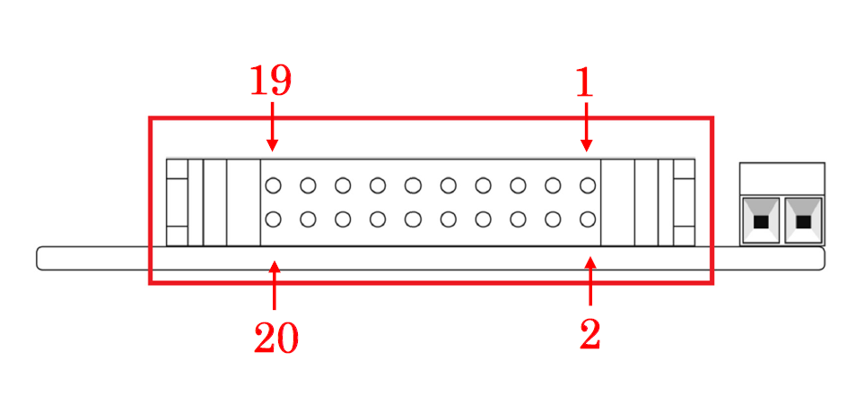

# RPi-GP10T / RPi-GP10M 各部名称と説明  
- RPi-GP10T: 端子台モデル  
- RPi-GP10M: MILコネクタモデル  
  
___  
## 1. 基板構成  
製品基板の各部名称は以下のとおりです。

| No | 名称 | 
|:-----:|:-----|
|1|GPIO 40PINコネクタ|
|2|COMMON電源端子|
|3|出力端子 8ch ※RPi-GP10T|
|4|入力端子 8ch ※RPi-GP10T|
|5|ストローブ出力端子 / トリガー入力端子(各1ch) ※RPi-GP10T|
|6|MILコネクタ (20PIN) ※RPi-GP10M|
___  
## 2. 各端子・コネクタについて  
### 2-1. GPIO 40PINコネクタ

40PIN GPIOのピン配列と説明 

| PIN# | 名称 | 説明 | PIN# | 名称 | 説明 |
|:---:|:---|:---|:---:|:---|:---|
|1|3.3V|3.3V電源|2|5V|5V電源|
|3|I2C SDA1/GPIO 2|I2C / SDA1 TCA9535制御用 |4|5V|5V電源|
|5|I2C SCL1/GPIO 3|I2C / SCL1 TCA9535制御用 |6|GND|GND|
|7|GPIO 4|(未使用)|8|UART TXD/GPIO 14|ストローブ出力（デフォルト）|
|9|GND|GND|10|UART RXD/GPIO 15|トリガー入力（デフォルト）|
|11|GPIO 17|(未使用)|12|GPIO 18|(未使用)|
|13|GPIO 27|絶縁電源制御|14|GND|GND|
|15|GPIO 22|(未使用)|16|GPIO 23|(未使用)|
|17|3.3V|3.3V電源|18|GPIO 24|(未使用)|
|19|SPI0 MOSI/GPIO 10|(未使用)|20|GND|GND|
|21|SPI0 MISO/GPIO 9|(未使用)|22|GPIO 25|(未使用)|
|23|SPI0 SCLK/GPIO 11|(未使用)|24|SPI CE0/GPIO 8|(未使用)|
|25|GND|GND|26|SPI CE1/GPIO 7|(未使用)|
|27|I2C SDA0/GPIO 0| HAT_ID読み込み用I2C |28|I2C SCL0/GPIO 1|HAT_ID読み込み用I2C|
|29|GPIO 5|(未使用)|30|GND|GND|
|31|GPIO 6|(未使用)|32|GPIO 12|ストローブ出力（オプション）|
|33|GPIO 13|トリガー入力（オプション）|34|GND|GND|
|35|GPIO 19|(未使用)|36|GPIO 16|(未使用)|
|37|GPIO 26|(未使用)|38|GPIO 20|(未使用)|
|39|GND|GND|40|GPIO 21|(未使用)|  

### 2-2. COMMON電源端子
  

外部電源入力端子のピン配列と機能

|PIN名|機能|
|:---:|:---|
|＋|5～24V 入力|
|－|GND|

### 2-3. 出力端子 8ch ※RPi-GP10T  

RPi-GP10T デジタル出力端子のピン配列と機能

|PIN名|機能|
|:---:|:---|
|0|デジタル出力ch0|
|1|デジタル出力ch1|
|2|デジタル出力ch2|
|3|デジタル出力ch3|
|4|デジタル出力ch4|
|5|デジタル出力ch5|
|6|デジタル出力ch6|
|7|デジタル出力ch7|

### 2-4. 入力端子 8ch ※RPi-GP10T  

RPi-GP10T デジタル入力端子のピン配列と機能

|PIN名|機能|
|:---:|:---|
|0|デジタル入力ch0|
|1|デジタル入力ch1|
|2|デジタル入力ch2|
|3|デジタル入力ch3|
|4|デジタル入力ch4|
|5|デジタル入力ch5|
|6|デジタル入力ch6|
|7|デジタル入力ch7|

### 2-5. ストローブ出力端子 / トリガー入力端子 (各1ch) ※RPi-GP10T  

RPi-GP10T ストローブ出力/トリガー入力端子のピン配列と機能

|PIN名|機能|
|:---:|:---|
|S|ストローブ出力|
|T|トリガー入力|

### 2-6. MILコネクタ（20PIN） ※RPi-GP10M  

RPi-GP10M 20PIN MILコネクタのピン配列と機能

|PIN名|機能|PIN名|機能|
|:---:|:---|:---:|:---|
|1|5～24V 入力|11|デジタル入力ch6|
|2|GND|12|デジタル入力ch7|
|3|トリガー入力|13|デジタル出力ch0|
|4|ストローブ出力|14|デジタル出力ch1|
|5|デジタル入力ch0|15|デジタル出力ch2|
|6|デジタル入力ch1|16|デジタル出力ch3|
|7|デジタル入力ch2|17|デジタル出力ch4|
|8|デジタル入力ch3|18|デジタル出力ch5|
|9|デジタル入力ch4|19|デジタル出力ch6|
|10|デジタル入力ch5|20|デジタル出力ch7|
___  

