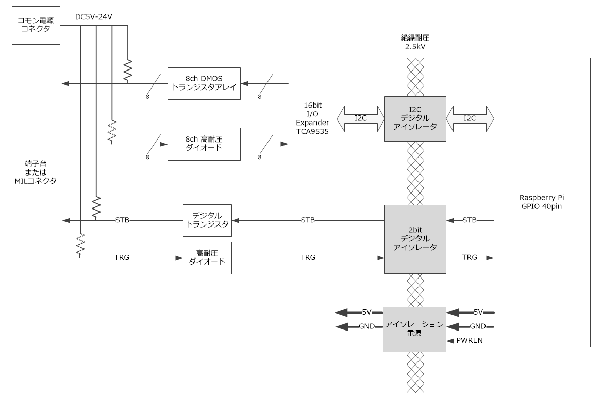
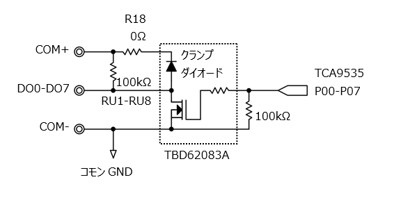
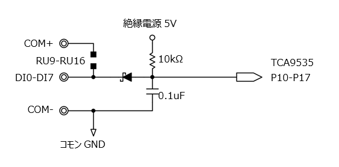
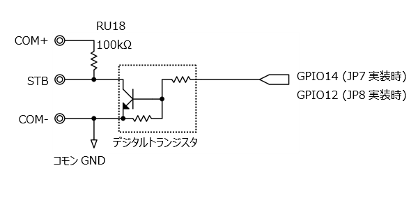
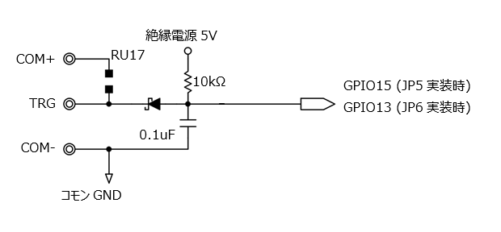

# RPi-GP10の機能と説明  
各インターフェースについて説明します。  

  
  

___  
## 1. インターフェース  
### 1-1. Rapsberry Pi GPIO 40pin  
RPi-GP10を制御するために、GPIO 40pinの下記の信号を使用します。  

<u>制御信号</u>  

|pin No.|説明|
|:--:|:--|
|3pin|I2C SDA1|
|5pin|I2C SCL1|
|8pin|GPIO14: ストローブ出力|
|10pin|GPIO15: トリガー入力|
|13pin|GPIO27: 絶縁電源制御出力|
|32pin|(GPIO12: ストローブ出力) ※抵抗の実装変更で使用可|
|33pin|(GPIO14 トリガー入力) ※抵抗の実装変更で使用可|

<u>電源</u>  

|pin No.|説明|
|:--:|:--:|
|1pin 17pin|3.3V|
|2pin 4pin|5V|
|6pin 9pin 14pin 20pin 25pin 30pin 34pin 39pin|GND|
  
### 1-2. I2C  
TI製TCA9535 I/Oエキスパンダを制御するために使用します。  
  
<u>I2Cアドレス</u>  
出荷時は`0x20`に設定されています。  
基板裏面の抵抗RA1-RA6の実装を変更することでI2Cアドレスを変更することができます。  
([RPi-GP10の設定と装着](../setup/README.md)参照)  
  
 <u>TCA9535 ポートレジスタ</u>  

|コマンドバイト|レジスタ名|設定値|説明|
|:--:|:--:|:--:|:--|
|0x00|ポート0入力データ|--|ポート0は出力設定なので未使用|
|0x01|ポート1入力データ|0xXX|ポート1入力データ bit7-0はデジタル入力ch7-0に対応 極性反転設定のため ‘0’で’H’, ’1’で’L’入力|
|0x02|ポート0出力データ|0xXX|ポート0出力データ bit7-0はデジタル出力ch7-0に対応 出力時に反転するので ‘0’で’H’, ’1’で’L’出力|
|0x03|ポート1出力データ|--|ポート1は入力設定なので未使用|
|0x04|ポート0極性反転設定|0x00|ポート0 極性反転なし|
|0x05|ポート1極性反転設定|0xFF|ポート1 極性反転あり|
|0x06|ポート0方向設定|0x00|ポート0 出力に設定|
|0x07|ポート1方向設定|0xFF|ポート1 入力に設定 ※衝突するので出力設定禁止|  
  
### 1-3. デジタル出力  
  
デジタル出力部は上図のような回路構成です。  
- DO0-DO7: デジタル出力チャンネル0-7  
- オープンドレイン出力方式  
    > TCA9535からのデータが反転して出力されます
- 最大定格はOFF時30V、ON時100mA/ch, ON抵抗2Ω  
- DO0-DO7はRU1-RU8(100kΩ)でCOM+へプルアップ  
    > プルアップが不要な場合はプルアップ抵抗RU1-RU8を外すか、COM+をオープンにしてください  
- クランプダイオードはR18(0Ω)を通してCOM+へ接続  
    > クランプ不要な場合はR18を外してください  
  
### 1-4. デジタル入力  
  
デジタル入力部は上図のような回路構成です。  
- DI0-DI7: デジタル入力チャンネル0-7  
- 高耐圧ダイオード入力方式  
- VIH=3.5V, VIL=1.5Vで耐圧30V  
- DI0-DI7はRU9-RU16でCOM+へプルアップ可能  
    > デフォルトはオープンです  
    > プルアップが必要な場合は任意の1608サイズの抵抗を実装してください  
- ダイオードのアノード側は絶縁電源5Vへ10kΩでプルアップ  
  
### 1-5. ストローブ出力  
  
ストローブ出力部は上図のような回路構成です。  
- STB: ストローブ出力  
- オープンコレクタ出力  
    > GPIO信号が反転して出力されます
- 最大定格はOFF時30V、ON時50mA  
- ジャンパ抵抗JP7/JP8で、GPIOを14または12へ切替えることが可能  
    > デフォルトはJP7が実装されていてGPIO14へ接続されています  
- STBはRU18(100kΩ)でCOM+へプルアップ  
    > 不要な場合はプルアップ抵抗RU18を外すか、COM+をオープンにしてください  
  
### 1-6. トリガー入力  
  
トリガー入力部は上図のような回路構成です。  
- TRG: トリガー入力  
- 高耐圧ダイオード入力方式  
- VIH=2.0V, VIL=0.8Vで耐圧30V  
- ジャンパ抵抗JP5/JP6で、GPIOを15または13へ切替えることが可能  
    > デフォルトはJP5が実装されていてGPIO15へ接続されています  
- TRGはRU17でCOM+へプルアップ可能  
    > デフォルトはオープンです  
    > プルアップが必要な場合は任意の1608サイズの抵抗を実装してください  
- ダイオードのアノード側は絶縁電源5Vへ10kΩでプルアップされています  
  

### 1-7. 絶縁電源制御出力  
- PWREN: 絶縁電源制御出力  
- High:ON Low:OFF
- TCA9535 I/OエキスパンダなどGPIO 40pinから絶縁された回路用電源を制御します。  
    > デジタル入出力・ストローブ出力・トリガー入力の制御を行う場合は、絶縁電源をONにしてください  

___  
  
## 2. コモン電源  
COM+,COM-: ５～24V入力  
デジタル入出力用のコモン電源です。最大30Vの耐圧があります。  
    
デジタル入出力・ストローブ出力・トリガー入力のプルアップ用電源として使用できます。

