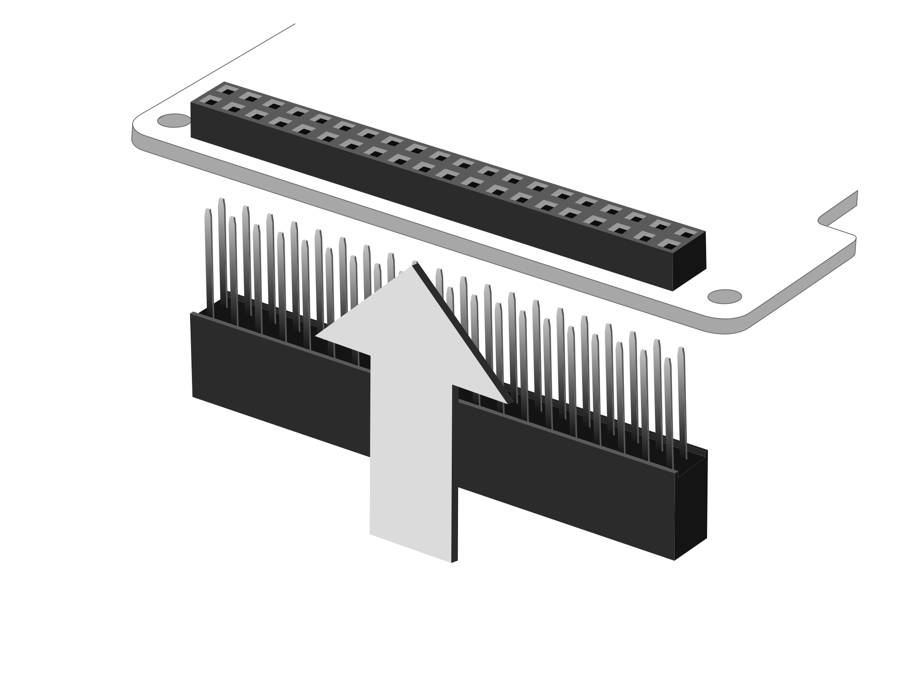

# RPi-GP10の設定と装着  
各種設定と本製品をRaspberry Pi GPIO 40PINに接続する方法を説明します。  

___  
## 1. 各種設定  
  
### 1-1. I2Cアドレスの設定  
抵抗(RA1, RA2, RA3, RA4, RA5, RA6)の実装によってI2Cアドレスを設定することができます。  
※初期設定は`0x20`(RA2, RA4, RA6実装)です。  
> 抵抗は、100kohm/1608サイズを使用してください

|RA1|RA2|RA3|RA4|RA5|RA6|I2Cアドレス||
|:--:|:--:|:--:|:--:|:--:|:--:|:--:|:--:|
|-|○|-|○|-|○|0x20|※初期設定|
|○|-|-|○|-|○|0x21|
|-|○|○|-|-|○|0x22|
|○|-|○|-|-|○|0x23|
|-|○|-|○|○|-|0x24|
|○|-|-|○|○|-|0x25|
|-|○|○|-|○|-|0x26|
|○|-|○|-|○|-|0x27|  
  
### 1-2. トリガー入力用GPIOの設定  
トリガー入力用GPIOの初期設定は`GPIO15`ですが、`JP5`を未実装にし`JP6`に0ohm/1608サイズの抵抗を実装することによって`GPIO13`に変更することができます。  
  
### 1-3. ストローブ出力制御用GPIOの設定  
ストローブ出力制御用GPIOの初期設定は`GPIO14`ですが、`JP7`を未実装にし`JP8`に0ohm/1608サイズの抵抗を実装することによって`GPIO12`に変更することができます。  

___  
## 2. 本体の組み立て  
製品付属の40PIN ピンヘッダーを本製品の底面より垂直に装着します。  
※40PINのピンヘッダーの先端は尖っていますので、怪我には十分ご注意ください。  

  

  

## 3. Raspberry Piボードとの接続  
Raspberry Pi 本体のGPIO ピンヘッダと本製品を接続します。  
スペーサー（付属）を本製品本体のネジ穴にあわせ、スペーサーを付
属のネジ（4 本）で固定し、そのままRaspberryPi のGPIO ピンへ垂
直に差し込みます。  
スペーサーがRaspberryPi 基板に合わされば接続は完了です。  
あとはRaspberryPi の背面より付属のネジ（4 本）を使用し、スペーサーを固定します。    
※反対側にも同じようにスペーサーとネジを使用し本体を固定してください。  

  
